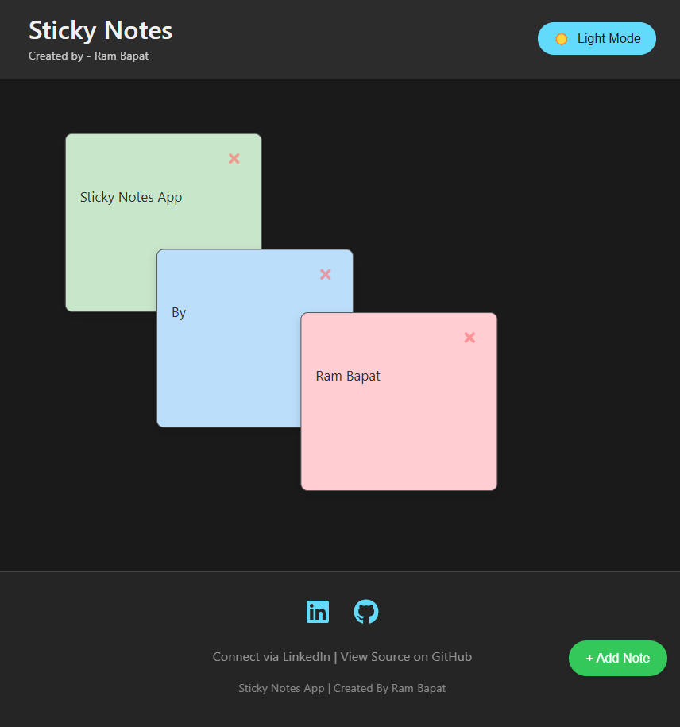
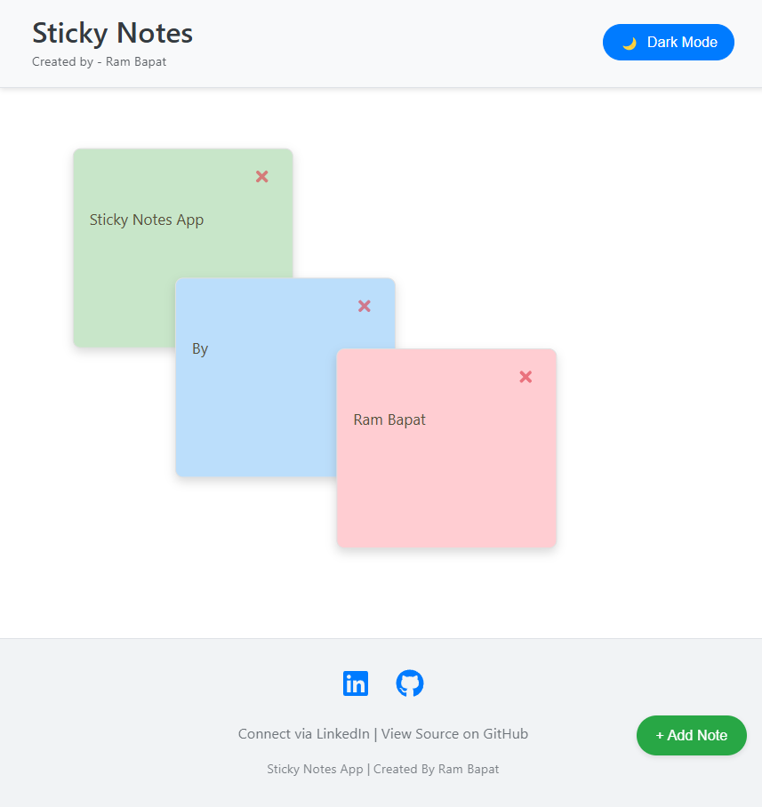
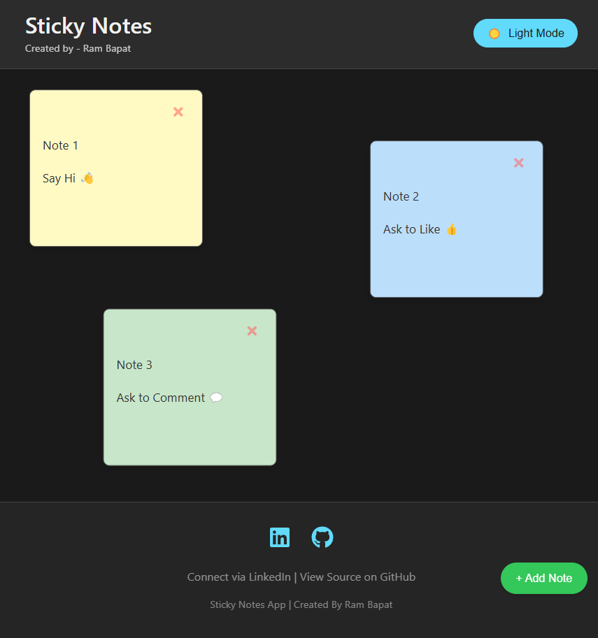

# Simple Sticky Notes (React + Vite) 📌✨

## Try the Live Demo - [Demo Link](https://sticky-notes-lyart.vercel.app/)

A simple, intuitive, and visually appealing sticky note application built with React and Vite. Allows users to create, drag, edit (with word limits), and delete notes on a digital canvas, with persistence via local storage and a dark/light theme toggle.

<!-- ================================================== -->





<!-- ================================================== -->

## Overview

This project provides a clean and modern interface for managing quick digital sticky notes. Users can easily add new notes with a click, type short messages (under a word limit), drag them anywhere on the screen, and discard them when no longer needed.

Key features include automatic saving of notes to the browser's local storage, ensuring your notes persist between sessions. The application defaults to a sleek dark theme but includes a toggle for switching to a light theme. It's designed to be responsive and functional across desktop, tablet, and mobile screen sizes. New notes cycle through a pleasant palette of pastel colors.

This project was created by Ram Bapat as part of the **#30DaysOfVibeCoding** challenge (April 2025), utilizing AI assistance for rapid development, brainstorming, and code generation/refinement.

## Features

*   **Add Notes:** Create new notes instantly with the "+ Add Note" button.
*   **Draggable Notes:** Easily reposition notes anywhere on the canvas using `react-draggable`.
*   **Editable Text:** Write short notes directly on the sticky (current limit ~50 words).
*   **Delete Notes:** Simple close ('X') button on each note to discard it.
*   **Dark/Light Theme Toggle:** Switch between visual modes using the header button.
*   **Persistent Storage:** Notes and their positions/content are saved in the browser's Local Storage.
*   **Responsive Design:** Adapts layout and elements for optimal viewing on desktop, tablet, and mobile devices.
*   **Cycling Note Colors:** New notes automatically cycle through a predefined set of background colors for visual variety.
*   **Modern UI:** Clean interface built with modern CSS (variables, flexbox, transitions) and React components.
*   **Iconography:** Uses `react-icons` for clear UI elements (close button, social icons).

## Tech Stack

*   **Frontend:** React 18+
*   **Build Tool:** Vite
*   **Styling:** CSS3 (including Flexbox, Custom Properties/Variables, Transitions)
*   **Language:** JavaScript (ES6+)
*   **Dragging:** `react-draggable`
*   **Icons:** `react-icons`
*   **Package Manager:** npm

## Getting Started

To get a local copy up and running, follow these simple steps.

### Prerequisites

*   Node.js (which includes npm) installed on your system. You can download it from [nodejs.org](https://nodejs.org/).
*   Git (for cloning the repository).

### Installation & Setup

1.  **Clone the repository:**
    ```bash
    git clone https://github.com/Barrsum/Sticky-Notes.git
    ```

2.  **Navigate to the project directory:**
    ```bash
    cd Sticky-Notes
    ```

3.  **Install NPM packages:**
    ```bash
    npm install
    ```

### Running the Project

1.  **Start the development server:**
    ```bash
    npm run dev
    ```
    This command will start the Vite development server.

2.  **Open the application:**
    Open your web browser and navigate to the local URL provided by Vite (usually `http://localhost:5173/` or a similar port).

## Contributing

Contributions, issues, and feature requests are welcome! Feel free to check the [issues page](https://github.com/Barrsum/Sticky-Notes/issues).

1.  Fork the Project
2.  Create your Feature Branch (`git checkout -b feature/AmazingFeature`)
3.  Commit your Changes (`git commit -m 'Add some AmazingFeature'`)
4.  Push to the Branch (`git push origin feature/AmazingFeature`)
5.  Open a Pull Request

## License

Distributed under the MIT License. Create a `LICENSE.md`.

## Acknowledgements

*   **Icons:** Provided by [React Icons](https://react-icons.github.io/react-icons/).
*   **Dragging:** Functionality via [React Draggable](https://github.com/react-grid-layout/react-draggable).
*   **React:** [react.dev](https://react.dev/)
*   **Vite:** [vitejs.dev](https://vitejs.dev/)
*   **AI Assistance:** Guidance and code snippets provided during the Vibe Coding session.

---

Built by **Ram Bapat** - Challenge [\#30DaysOfVibeCoding](https://www.linkedin.com/posts/ram-bapat-barrsum-diamos_vibecoding-ai-machinelearning-activity-7312839191153860608-wQ8y?utm_source=share&utm_medium=member_desktop) - [LinkedIn Profile](https://www.linkedin.com/in/ram-bapat-barrsum-diamos) - [GitHub Repository](https://github.com/Barrsum/Sticky-Notes)
